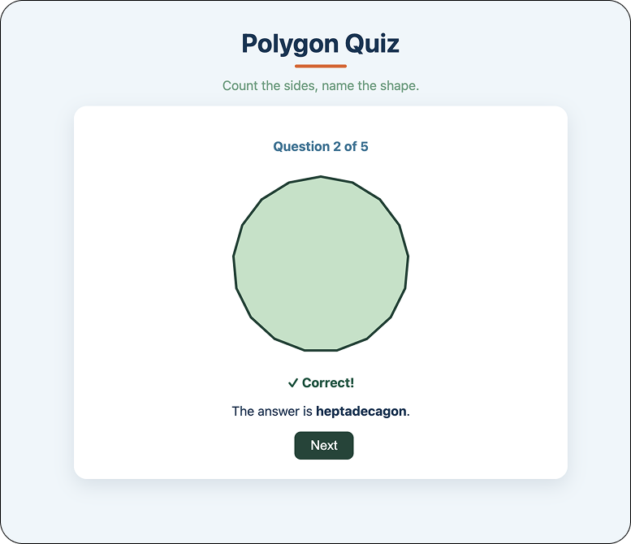

# Polygon Quiz

Polygon Quiz is a small React and TypeScript game about recognising polygons. The player is shown a shape, counts the sides, types the polygon name, and moves through a five question round. At the end, the game shows the final score and lets the player start again.

The number of sides used in the polygon quiz goes all the way up to 20, which might feel a little bit excessive; however, once you reach shapes like the one in Figure 1, the result is satisfying. A heptadecagon, by the way, has 17 sides. Neither of us knew that before starting this project, but we definitely do now. You can check out the live game [here](https://aise-poly-game.vercel.app/).



This is a graphic project as much as a quiz project. The interesting part is not only the answer checking. The app draws the shape itself using SVG, so the player is not looking at fixed image files. Each polygon is generated from code.

## What the game does

The game creates a short round of polygon questions. Each question stores the number of sides and the correct answer. React uses that question data to decide what to show on screen. If the question has five sides, the SVG component draws a pentagon. If the question has eight sides, it draws an octagon. The player does not see the data directly, but the whole interface is driven by it.

The answer checker is deliberately forgiving. It ignores capital letters and extra spaces, so `Octagon`, ` octagon `, and `OCTAGON` are treated as the same answer. It also accepts a few alternative polygon names where that makes sense, such as square for a four sided polygon.

## How React is used

React breaks the game into small pieces. The main `App` component gives the page its title and then hands the actual quiz to `QuizGame`. `QuizGame` manages the current round, the current question number, the player’s typed answer, the score, and whether the round has finished.

When the player types into the input, React stores that text in state. When the player submits an answer, React checks the guess, updates the result, and re renders the screen. That is why the page can switch from the input form to the feedback message without loading a new page.

The game feels simple on the surface, but it uses the core React idea properly. The screen is a reflection of state. Change the state, and React updates the screen.

## How the SVG drawing works

The `PolygonSvg` component draws the shape using the browser’s built in SVG support. It does not use a picture of a triangle, square, pentagon, or octagon. It calculates the points of the polygon and passes them into an SVG `<polygon>` element.

## Polygon SVG Component

This component creates polygon graphics dynamically using React, TypeScript, maths, and SVG.

The file begins with a TypeScript type:

```ts
export type PolygonSvgProps = {
  sides: number;
  size?: number;
  colorIndex?: number;
};
```

This defines the props the component can receive.

Props are values passed into a React component from another component.

For example:

```tsx
<PolygonSvg sides={6} />
```

Here, `sides={6}` is a prop.

The `sides` prop tells the component how many sides the polygon should have.

The `size` prop controls the width and height of the SVG canvas.

The `?` symbol means the prop is optional.

If no size is provided, the component uses a default value.

The `colorIndex` prop selects a colour combination from the colour array.

The type is exported because other files may need to import it.

For example, another component might want autocomplete or type checking for the props.

The component stores colour pairs here:

```ts
const COLOR_PAIRS = [
  { fill: '#c8eaf7', stroke: '#0d3353' },
]
```

Each polygon therefore has both a fill colour and an outline colour.

The geometry is generated inside the `computeVertices()` function.

```ts
function computeVertices(
  sides,
  cx,
  cy,
  radius,
)
```

This function calculates the coordinates for every polygon corner.

The loop runs once for every side:

```ts
for (let i = 0; i < sides; i++)
```

The polygon is mathematically built around the centre of the SVG canvas.

For every iteration, the function calculates an angle around a circle:

```ts
const angle = startAngle + (i * 2 * Math.PI) / sides;
```

The coordinates are generated using trigonometry:

```ts
Math.cos(angle)
Math.sin(angle)
```

`Math.cos()` calculates horizontal movement.

`Math.sin()` calculates vertical movement.

The generated coordinates are stored as `[x, y]` pairs.

The function returns an array containing all polygon vertices.

The React component itself is exported here:

```ts
export function PolygonSvg()
```

The function is exported so other files can import and render the component.

For example:

```tsx
import { PolygonSvg } from './PolygonSvg';
```

Inside the component, the vertices are converted into SVG coordinate text:

```ts
.map(([x, y]) => `${x},${y}`)
.join(' ')
```

SVG polygons require coordinates in this format:

```ts
"100,20 180,80 150,160"
```

The SVG is then rendered using JSX:

```tsx
<svg>
  <polygon points={points} />
</svg>
```

React converts this JSX into real SVG markup in the browser.

The browser finally draws the polygon visually using those coordinates.

The SVG also includes accessibility attributes:

```tsx
role="img"
aria-label="A polygon to identify — count its sides"
```

This allows screen readers to interpret the SVG as an image.

The result is a React component that combines TypeScript, maths, SVG graphics, accessibility, and declarative rendering together.

## How the SVG Component is Tested

The SVG tests focus on the geometry of the polygon rather than screenshots.

The tests render the React SVG component using React Testing Library and inspect the generated `<polygon>` element directly.

SVG polygons store coordinates inside a `points` attribute such as:

```ts
"100,20 180,80 150,160"
```

The `parsePoints()` helper converts this string into numeric coordinate arrays so the geometry can be tested mathematically.

The first test checks accessibility:

```ts
expect(getByRole('img')).toBeInTheDocument();
```

This ensures the SVG behaves like an accessible image.

The next tests check whether the polygon generates the correct number of vertices for the selected number of sides.

For example:

```ts
render(<PolygonSvg sides={6} />);
```

should produce six coordinate points.

The tests also check multiple polygon sizes including triangles and 20-sided polygons to ensure the maths works consistently across different shapes.

The final test checks that every vertex remains inside the SVG viewport.

```ts
expect(x).toBeGreaterThanOrEqual(0);
expect(x).toBeLessThanOrEqual(size);
```

This prevents polygons from being clipped outside the visible SVG canvas.

The component generates coordinates using trigonometry with functions such as:

```ts
Math.cos(angle)
Math.sin(angle)
```

React then converts those calculated coordinates into SVG markup which the browser renders visually.

The tests therefore validate the React rendering, the SVG structure, and the mathematical correctness of the polygon together.

## Component map

`main.tsx` starts the React app and places it inside the page.

`App.tsx` gives the project its title and tagline, then renders the quiz.

`QuizGame.tsx` controls the game flow. It creates a round, shows the current question, records the player’s answer, checks the result, moves to the next question, and shows the final score.

`PolygonSvg.tsx` draws the polygon for the current question. It turns a number of sides into SVG coordinates.

`quizEngine.ts` contains the quiz logic. It creates rounds, checks answers, handles accepted alternatives, and keeps the logic away from the interface.

`polygonNames.ts` contains the polygon name lookup. It knows which names match which side counts and rejects values that are not supported.

`index.css` styles the game so the quiz feels like one complete small product rather than a raw coding exercise.

## How the tests were written

The tests were written around behaviour, not around private implementation details. That matters because a user does not care what a state variable is called. A user cares whether the title appears, whether a polygon appears, whether the answer can be submitted, and whether the score is correct.

The domain tests check the plain logic first. `polygonNames.test.ts` checks that side counts return the right names, that shapes with fewer than three sides are rejected, and that unsupported values do not silently pass. `quizEngine.test.ts` checks that answers are accepted correctly, that spaces and capital letters do not break a correct answer, that synonyms work, and that generated rounds contain valid, non repeated polygons.

The SVG tests check the graphic part directly. `PolygonSvg.test.tsx` renders the SVG and checks that it is accessible as an image. It also reads the `<polygon>` points and counts them. That means the test can prove a six sided question really produces six vertices. Another test checks that every vertex stays inside the SVG viewport, which is important because a drawing can technically exist while still being partly off screen.

The game tests use React Testing Library and user event to interact with the app more like a real player. The tests type answers, click buttons, move through the round, and check the final score. A fixed round is injected into `QuizGame`, so the tests do not depend on random questions. That makes the tests reliable and repeatable.

This is the stronger testing pattern in the project. Randomness is useful for the player, but it is awkward for tests. By allowing the game to receive a known round during testing, the app keeps the real behaviour while the tests stay predictable.

## Why this project is useful

This project is small enough to understand, but it still has the shape of a real React app. It has separate UI components, separate domain logic, generated graphics, stateful interaction, and automated tests.

It is also a good teaching project because the player can see the code working visually. When the number of sides changes, the shape changes. When the answer is submitted, the feedback changes. When the round ends, the result screen appears. That makes React’s state driven model easier to understand because each change has an obvious effect on the screen.

## Running the project locally

Install the dependencies with

```bash
npm install
```

Start the development server with `npm run dev`.

Run the tests in watch mode with `npm test`.

Run the tests once with `npm run test:run`.

Create a production build with `npm run build`.

## Final note

Polygon Quiz is not trying to be a huge app. It is a clean, focused example of how React, TypeScript, SVG, and tests can work together. The game gives learners something visual to play with, while the codebase shows how to keep logic, graphics, and interaction separated clearly.
